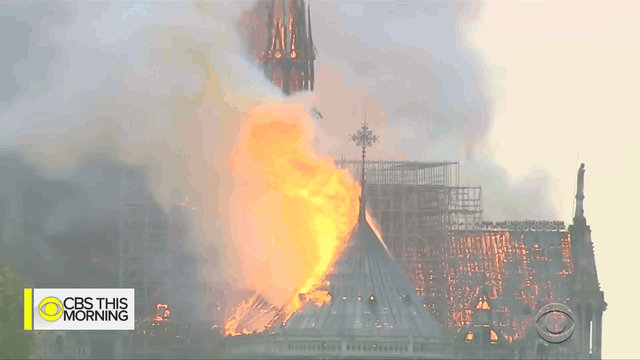
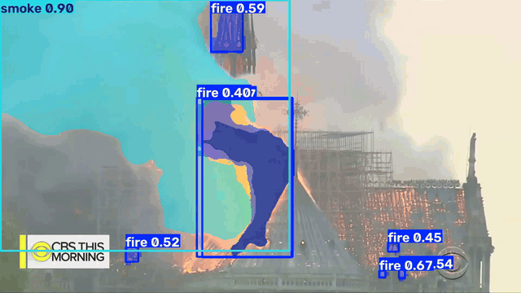

# Computer Vision

## Computer Vision course at UFSC
 
 A computer vision course taught during the first semester of 2026 at the Universidade Federal de Santa Catarina (UFSC), covering the study of neural networks and image processing using Python, OpenCV, NumPy, Matplotlib, TensorFlow, and YOLO.

## Fire and Smoke Project

Research of fire and smoke detection at the VISIA Computer Vision Laboratory (UFSC).

### Detections

#### **Bounding Box**

>flame_smoke_detection_box: best.pt (fine-tune) | best mAP50 (box): 

>Params: epochs=100, imgsz=640, batch=256, workers=12, optimizer='auto', lr0=0.0002, lrf=0.01, cos_lr=True, warmup_epochs=1.0, weight_decay=0.0005, cls=0.5, mosaic=0.8, close_mosaic=30, mixup=0.05, hsv_h=0.15, hsv_s=0.5, hsv_v=0.5, degrees=0.0, scale=0.3, translate=0.05, fliplr=0.5, flipud=0.0

#### **Segmentation**

>firesmoke4_seg: yolo26n-seg.pt | best mAP50 (box): 0.697, best mAP50 (mask): 0.595 

>Params: epochs=300, imgsz=640, batch=32, lr0=0.0005, lrf=0.01, cos_lr=True, warmup_epochs=1.0, mixup=0.15, copy_paste=0.3, mosaic=1.0 | roboflow aug: grayscale 15%, brightness: 10% 

| Original | Output |
| --- | --- |
|  |  |
|  |  |
|  |  |
|  |  |
|  |  |

## Articles

"An open flame and smoke detection dataset for deep learning in remote sensing based fire detection"

>[document](articles/An%20open%20flame%20and%20smoke%20detection%20dataset%20for%20deep%20learning%20in%20remote%20sensing%20based%20fire%20detection.pdf), [dataset](https://universe.roboflow.com/forestfiresmoke/fasdd_cv-dx83j)

"The Wildfire Dataset Enhancing Deep Learning-Based Forest Fire Detection" 

>[document](articles/Wildfire%20Dataset%20Enhancing%20Deep%20Learning-Based%20Forest%20Fire%20Detection.pdf), [dataset](https://www.kaggle.com/datasets/elmadafri/the-wildfire-dataset)

## Notes

> Use reliable datasets from articles with a balanced number of classes for fire, smoke and null images.

> Improve training with augmentations, parameters, and null-imgs.

> SAM3 / NVIDIA LocateAnything auto-label annotations are causing problems and false metrics.

**Dependencies**: uv, ultralytics yolo, google colab, tensorflow, opencv

**Datasets**: [roboflow](https://roboflow.com/), [open images v7](https://storage.googleapis.com/openimages/web/index.html), [aws open data](https://registry.opendata.aws/), [huggingface](https://huggingface.co/datasets)

**Annotations**: [CVAT](https://app.cvat.ai), roboflow

---

## Structure
| Folder |  Description |
| --- | --- |
| neural_net/ | python code and books for NNs |
| image_processing/ | python code for image manipulation |
| models/ | trained models for fire and smoke detection |